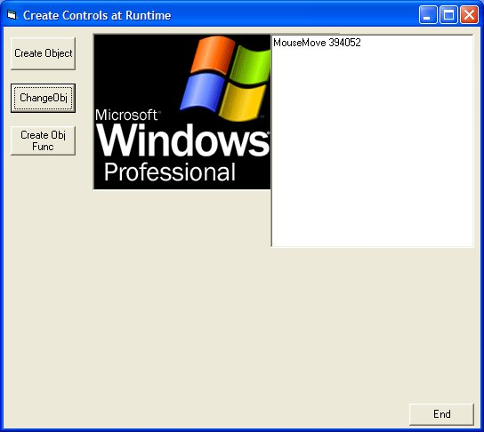



## Create Controls at Runtime and program their events

### Description

OK! i will change the code comment. I don't wanna win the code contest. You must not look at the horrible graphics, but the code. How do create or clone a control? By creating a control array? By the method explained by venky dude? (good tutorial venky) This is simple a new way to create a control than can expand our knowledge of visual basic. You can create control, assign a name and code to the events in the way yo want. You can also remove the controls by it's own name (form1.controls.remove "goofy"). Try to do this in a control array!!! unload commandbutton(11). You still have 20 command button with control number 11 removed (more complicated).
 
### More Info
 
a little of experience

             |
---                |---
**Submitted On**   |2002-10-14 16:00:46
**By**             |[Amiga Blitter](https://github.com/Planet-Source-Code/PSCIndex/blob/master/ByAuthor/amiga-blitter.md)
**Level**          |Advanced
**User Rating**    |3.7 (11 globes from 3 users)
**Compatibility**  |VB 6\.0
**Category**       |[Custom Controls/ Forms/  Menus](https://github.com/Planet-Source-Code/PSCIndex/blob/master/ByCategory/custom-controls-forms-menus__1-4.md)
**World**          |[Visual Basic](https://github.com/Planet-Source-Code/PSCIndex/blob/master/ByWorld/visual-basic.md)
**Archive File**   |[Create\_Con14599510142002\.zip](https://github.com/Planet-Source-Code/amiga-blitter-create-controls-at-runtime-and-program-their-events__1-39816/archive/master.zip)

### API Declarations

just 2 api and a couple of constants declarations

